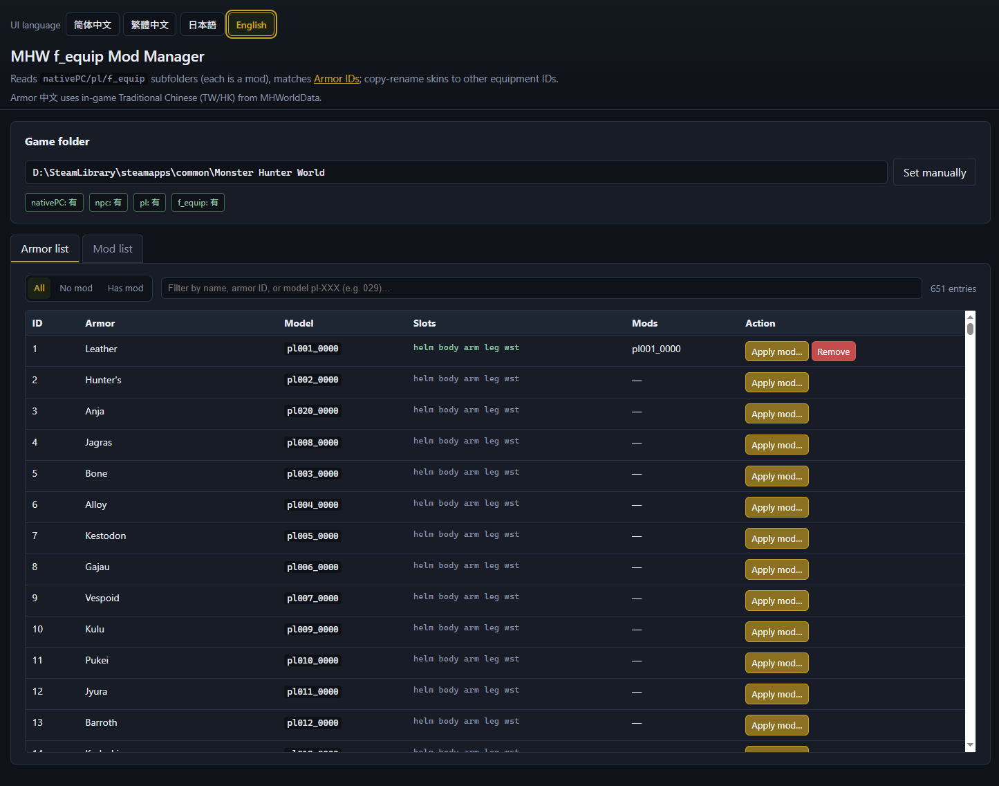

<!-- Language: English -->
**[`中文`](./readme-cn.md)**

## MHW f_equip Mod Manager

A small **FastAPI** web app to help manage Monster Hunter: World (MHW) player equipment `nativePC/pl/f_equip` mods.

It can list installed `f_equip` mods, show coverage per armor model, and **apply (copy + rename)** a mod from one `plXXX_YYYY` model to another. It also supports importing a mod archive (`.zip` / `.7z` / `.rar`) by auto-detecting `plXXX_YYYY` folders inside the archive.

## Screenshots (v0.1.0)



## Features

- **Game path detection**: set the MHW install folder (the folder that contains `nativePC`) via UI or `MHW_ROOT`.
- **Mod list**: list `nativePC/pl/f_equip/*` mod folders and detect contained models.
- **Armor coverage**: show which armor models are covered by which mods (per slot).
- **Apply mod (installed)**: copy a selected source mod and rename files to a target model.
- **Apply mod (archive)**: drag & drop an archive and apply from detected `plXXX_YYYY` sources.
- **Optional backup**: backup existing target folder to `f_equip/backup` before overwrite.

## Requirements

- Python 3.10+ (recommended)
- Dependencies in `requirements.txt`

## Install

```bash
pip install -r requirements.txt
```

## Run

```bash
python -m mhw_pl_manager
```

Then open the app:

- `http://127.0.0.1:8765/`

## Configure game root

The app will try to auto-detect the MHW game root from your Steam library (defaulting to `\Monster Hunter World` under Steam).
If auto-detection fails, you must point the app to your MHW game root (the folder containing `nativePC`):

- **In the UI**: use the “Manual path” button.
- **Environment variable**: set `MHW_ROOT` to the game root folder.

## Notes

- This tool **writes files** under `nativePC/pl/f_equip`. Enable backup if you want an easy rollback.
- Archive import supports `.zip`, `.7z`, `.rar`. For some `.rar` files you may need an external UnRAR tool available on your system.

